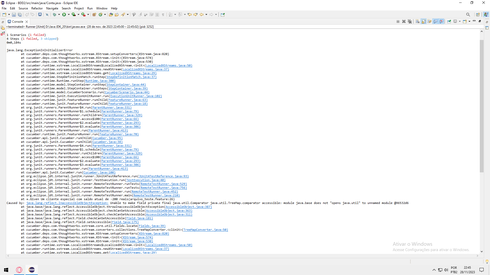
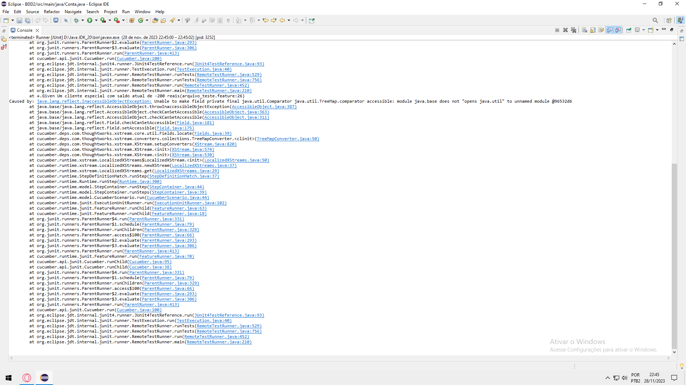
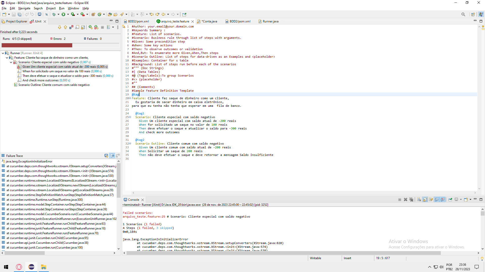

# cucumber_teste
<h1>Simulação situação banco</h1>

A situação simula uma situação de saque de um cliente especial e de um cliente normal. 
Exemplo de situação: Cliente especial com saldo negativo. 
                     Saldo atual: -R$200  
                     Saque efetuado: R$200  
(Situação só é possível por ser um cliente especial).  

<h1>Documentação</h1>

Foi criado um javadoc para a documentação e também foram colocadas tags orientadando o projeto.

<h1>Teste JUnit</h1>

Ao realizar teste unitário de Java, foi possível obter resultados e apontamento de erros sobre o projeto.

<h2>Imagens do resultado JUnit</h2>

<h1>BDD - Behavior Driver Development</h1>

BDD, ou Desenvolvimento Orientado a Comportamento (em inglês, Behavior-Driven Development), é uma abordagem de desenvolvimento de software que se concentra na colaboração entre diferentes partes interessadas, como desenvolvedores, testadores e não técnicos, para garantir que o software seja construído com base no comportamento desejado.

<h1>Ambiente de teste</h1>

Para o desenvolvimento do projeto foi necessária a utilização do Cucumber (Cucumber é usado para descrever o valor do negócio em uma linguagem natural, por isso permite que equipes de desenvolvimento de software descrevam como o software deve se comportar em texto simples, escrevendo especificações através de exemplos).

<h2>Imagem do ambiente de teste Cucumber</h2>

<h1>Classe Conta</h1>

Foi necessária a criação de uma classe conta para realizar as funcionalidades da simulação de antendimento do banco

